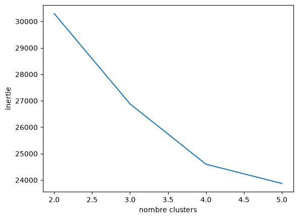

# Customer-Churn-Analysis-Segmentation-Prediction

## Project Context

A telecommunications company wants to better understand its customers in order to analyze customer behavior and identify customers who are likely to churn.

This project uses historical customer data containing information about customer characteristics, subscribed services, contract type, tenure, billing, and churn status.

The objective of the project is to analyze the dataset, prepare the data for Machine Learning, identify relationships between customer characteristics and churn, and prepare the resulting dataset for subsequent Machine Learning tasks.

---

## Dataset

The dataset contains **7,043 customers** and **21 variables**.

The available information includes:

* Customer identification
* Gender
* Senior citizen status
* Partner and dependent status
* Tenure
* Phone service
* Multiple lines
* Internet service
* Online security
* Online backup
* Device protection
* Technical support
* Streaming TV
* Streaming movies
* Contract type
* Paperless billing
* Payment method
* Monthly charges
* Total charges
* Churn status

The **`Churn`** variable is used as the target variable.

---

# 1. Data Analysis and Preparation

The first part of the project focuses on exploring and preparing the dataset before applying Machine Learning techniques.

## 1.1 Data Loading and Inspection

The dataset is loaded using Pandas.

The initial inspection includes:

* Displaying the first rows of the dataset.
* Checking the dataset dimensions.
* Inspecting column names and data types.
* Examining numerical and categorical variables.
* Computing descriptive statistics.

The dataset contains 7,043 observations and 21 columns.

---

## 1.2 Data Type Transformation

Several variables containing binary information are transformed into boolean values.

For example, values such as:

```text
Yes / No
```

are converted into:

```text
True / False
```

This transformation is applied to binary customer attributes and service-related variables.

The `SeniorCitizen` variable is also converted to a boolean type.

---

## 1.3 Exploratory Data Analysis

Exploratory Data Analysis is performed using **Pandas, Matplotlib, and Seaborn**.

### Distribution Analysis

Histograms with KDE are used to visualize the distributions of the dataset variables.

These plots provide a visual overview of the distribution of the different features.

### Numerical Feature Analysis

The numerical features are identified separately from the categorical features.

Boxplots are then used for the numerical variables to inspect their distributions and identify potential extreme values.

The numerical variables analyzed with boxplots include:

* `tenure`
* `MonthlyCharges`
* `TotalCharges`

---

## 1.4 Missing Values

Missing values are checked during the data preparation stage.

Missing values in `TotalCharges` are replaced with `0`.

```python
data.fillna({'TotalCharges': 0}, inplace=True)
```

---

# 2. Churn Analysis

The features and target variable are separated into:

```python
X = data.iloc[:, :-1]
y = data.Churn
```

The target variable is therefore:

```text
Churn
```

---

## 2.1 Churn Distribution

The distribution of the target variable is visualized using a count plot.

The dataset contains an imbalanced target distribution:

* Approximately **76%** of customers have `Churn = No`.
* Approximately **24%** of customers have `Churn = Yes`.

This class distribution is taken into consideration when analyzing the churn prediction problem.

---

## 2.2 Correlation Analysis

The categorical features are temporarily converted into numerical category codes in order to calculate correlations.

The correlation between the encoded features and the encoded `Churn` variable is analyzed.

A correlation matrix is also generated using a heatmap to visualize the relationships between the variables.

The heatmap provides a global view of the correlations between the encoded features and the churn target.

---

# 3. Data Preprocessing

After the exploratory analysis, the features are transformed into numerical representations suitable for Machine Learning.

## 3.1 Categorical Feature Encoding

Categorical features are identified using their data types.

`OneHotEncoder` is used to transform categorical variables into numerical binary features.

The encoder is configured with:

```python
OneHotEncoder(
    handle_unknown="ignore",
    sparse_output=False
)
```

The `customerID` column is excluded from the categorical encoding process.

The resulting encoded features are stored in a new DataFrame.

The redundant `gender_Male` feature is then removed.

---

## 3.2 Boolean Feature Encoding

Boolean features are identified separately.

`LabelEncoder` is used to convert boolean values into numerical values.

The same transformation approach is also applied to the `Churn` target variable.

---

## 3.3 Numerical Feature Scaling

The numerical features are identified and scaled using `MinMaxScaler`.

```python
numerical_scaler = MinMaxScaler()
```

The numerical features are transformed before being combined with the encoded features.

---

## 3.4 Preprocessed Dataset

The preprocessing operations produce the dataset:

```python
X_preprocessed
```

This dataset contains numerical representations of the categorical, boolean, and numerical features and is prepared for the next Machine Learning stages of the project.

---

## 2. Client Segmentation and Clustering

This phase focuses on preparing the cleaned dataset for customer segmentation and determining an appropriate number of clusters.

### 2.1. Data Loading

The cleaned dataset was loaded and prepared as the input for the clustering analysis. Since the data had already been cleaned and transformed into numerical features, it was directly used for the clustering preparation stage.

### 2.2. Determining the Number of Clusters

The **Elbow Method** was applied to identify a suitable number of clusters (`n_clusters`) for the K-Means algorithm.

The method evaluates the **inertia** for different values of `k`. Inertia measures the sum of squared distances between each observation and the centroid of its assigned cluster.

The value of `k` is selected by looking for an **elbow point**, where increasing the number of clusters produces significantly smaller improvements in inertia.

```python
inertias = []

for k in range(2, 6):
    kmeans = KMeans(
        n_clusters=k,
        random_state=42,
        n_init=10
    )

    kmeans.fit(X)
    inertias.append(kmeans.inertia_)
```

The resulting Elbow curve will be used to determine the number of clusters to apply in the next stage of the customer segmentation process.



The Elbow Method indicated that 4 clusters (k = 4) provide a suitable balance between reducing inertia and avoiding an unnecessarily large number of clusters.

---

# Technologies Used

The analysis and preprocessing are implemented in Python using:

* **Python**
* **Pandas** — data loading, manipulation, and analysis
* **NumPy** — numerical operations
* **Matplotlib** — visualization
* **Seaborn** — statistical visualization
* **Scikit-learn** — encoding and feature scaling

---

# Current Workflow

The work completed in this notebook can be summarized as:

```text
Raw Dataset
     │
     ▼
Data Loading
     │
     ▼
Dataset Inspection
     │
     ▼
Data Type Transformation
     │
     ▼
Exploratory Data Analysis
     │
     ├── Distribution Analysis
     ├── Numerical Feature Analysis
     ├── Missing Value Analysis
     └── Correlation Analysis
     │
     ▼
Churn Analysis
     │
     ▼
Feature Encoding
     │
     ├── One-Hot Encoding
     ├── Boolean Encoding
     └── Target Encoding
     │
     ▼
Numerical Feature Scaling
     │
     ▼
X_preprocessed
```

---

## Project Status

The current notebook covers the **data analysis, churn analysis, and preprocessing stages** of the project.

The resulting `X_preprocessed` dataset is prepared for the subsequent Machine Learning stages.
